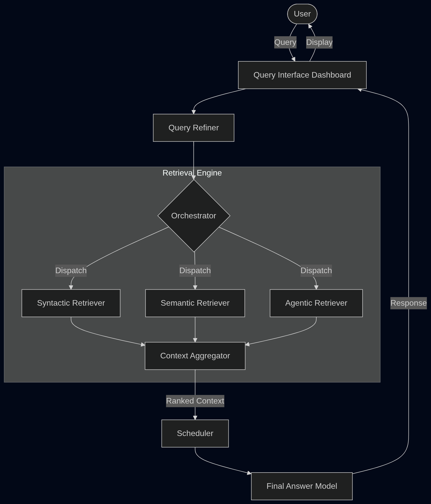
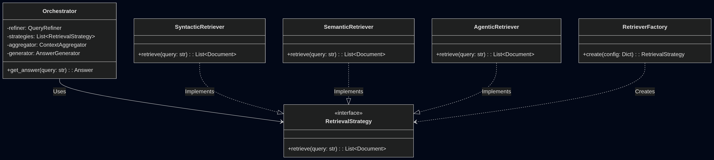

# System Overview: AAMSIR (Adaptive Architecture for Multi-Strategy Information Retrieval)

## 1. Introduction
AAMSIR is a retrieval-augmented generation (RAG) system designed to bridge the gap between traditional syntactic search and modern semantic capabilities. By employing a multi-strategy retrieval approach, it ensures high recall and precision across diverse document types.

## 2. Main Subsystems

The system is architecturally divided into two primary planes: the **System-Level Interface (Presentation Plane)** and the **Retrieval & Processing Plane (Backend)**, which further contains the Ingestion, Retrieval, and Generation subsystems.

### 2.1 System-Level Interface (Presentation Layer)
This layer handles all user interactions and preliminary query processing.
*   **Query Interface Dashboard:** A web-based UI where users submit natural language queries, view generated answers, examine cited sources, and provide feedback.
*   **Query Refiner:** A preprocessing component that sanitizes inputs, expands acronyms, and parses queries to ensure downstream retrievers receive optimized input.

### 2.2 Document Ingestion Pipeline
A linear "Pipe-and-Filter" subsystem responsible for transforming raw documents into indexed data.
*   **Normalization & Extraction:** Standardizes filenames and extracts raw text from various formats (PDF, Markdown, TXT).
*   **Meta-Summarization:** Generates concise summaries (domain, intent, scope) for each document to aid in preliminary semantic filtering.
*   **Embedding Service:** Vectorizes both document summaries and full content using a shared encoder model for consistency.

### 2.3 Hybrid Retrieval Engine
The core engine enabling AAMSIR's "Adaptive" capabilities. It employs a **Microkernel architecture** where specific retrieval strategies are plugged in as modules.
*   **Syntactic Retriever:** Peforms traditional keyword-based search (e.g., BM25, N-gram) to catch exact phrase matches often missed by semantic models.
*   **Semantic Retriever:** Uses vector similarity to find conceptually related documents. It employs a **Chain of Responsibility** pattern with a cascading filter (Title Match $\to$ Summary Similarity $\to$ Content Similarity) to efficiently narrow down candidates.
*   **Agentic Retriever:** An autonomous module where a Small Language Model (SLM) uses system tools (`ls`, `grep`, `cat`) to actively navigate the file system and "investigate" the query. It is wrapped in a **Caching Proxy** to optimize performance for repeated queries.

### 2.4 Generation & Orchestration Layer
Responsible for synthesizing the final response from the retrieved data.
*   **Orchestrator:** The central controller (Facade) that coordinates the refinement, retrieval, and generation steps. It ensures the request flows smoothly between subsystems.
*   **Context Aggregator:** Merges results from the three retrievers, removes duplicates, and ranks documents to construct the final context window ($K$).
*   **Scheduler:** Acts as a broker to manage resource allocation for LM inference, handling request prioritization and load balancing.
*   **Final Answer Model:** The language model (SLM) that generates the user-facing response based on the aggregated context and original query.

### 2.5 Data Persistence Layer
*   **Vector Database:** Stores high-dimensional embeddings for semantic search.
*   **Document Store:** Stores the raw text, metadata, and summaries of ingested files.

## 3. System Visualizations

### 3.1 High-Level Architecture
The following diagram illustrates the flow of a user query through the system, highlighting the interaction between the Presentation, Retrieval, and Generation layers.

### 3.2 Core Class Diagram (UML)
This class diagram depicts the core design patterns used in the retrieval engine: the **Facade** (Orchestrator), the **Strategy Pattern** (RetrievalStrategy), and the **Factory** (RetrieverFactory).

**Note:** The above design elements are not meant to represent the exact implementation but rather to illustrate the architectural patterns and interactions between components. The actual code may involve additional classes, interfaces, and design considerations based on specific implementation details.
