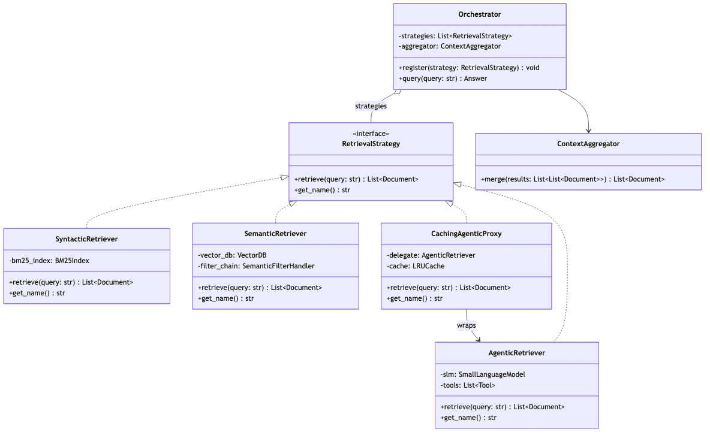
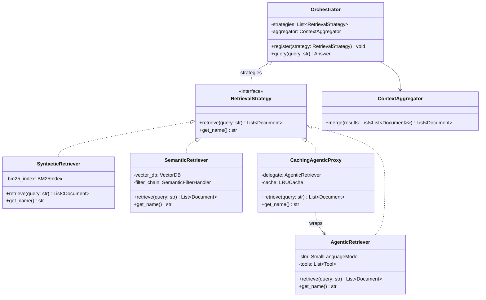
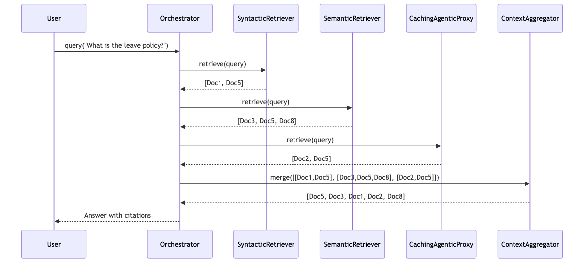
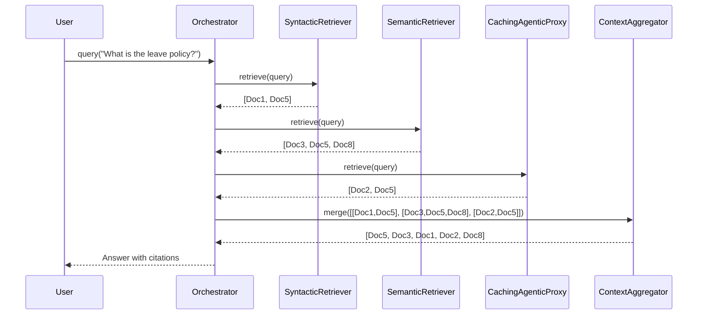
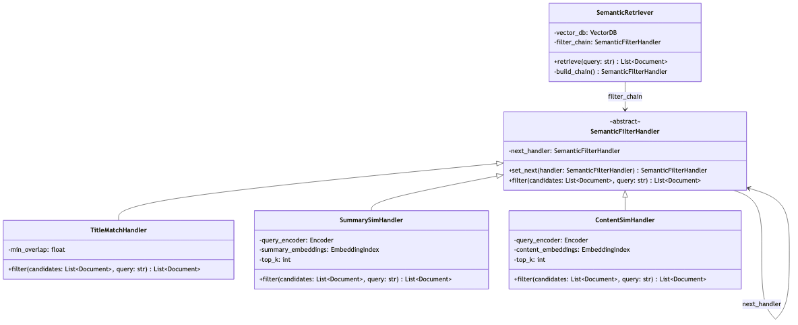
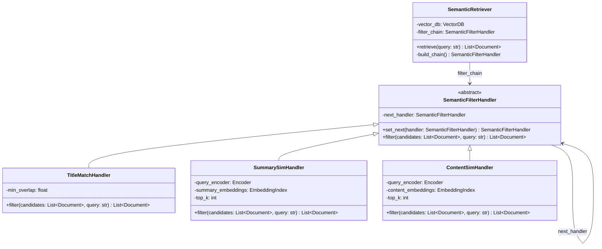
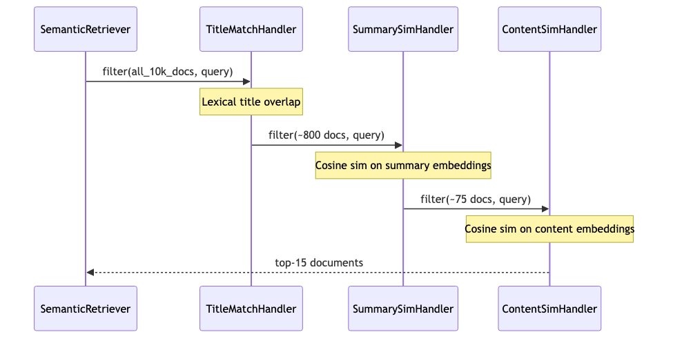
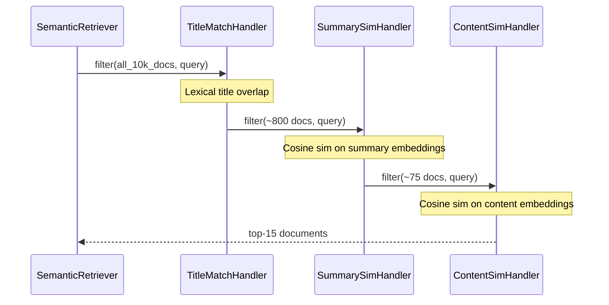

# Implementation Patterns: AAMSIR

## 1. Introduction
This document describes the two primary **Gang of Four (GoF) design patterns** applied within AAMSIR's implementation. For each pattern, we describe the problem it solves, its structure in the context of AAMSIR, and provide UML class and/or sequence diagrams.

---

## Pattern 1: Strategy Pattern

### Problem
The AAMSIR retrieval engine must support three fundamentally different retrieval algorithms — keyword-based (Syntactic), vector-similarity (Semantic), and tool-driven (Agentic). These algorithms are not interchangeable at the code level; each has different internal logic, dependencies, and performance characteristics. However, from the `Orchestrator`'s perspective, they all serve the same purpose: given a query, return a ranked list of documents.

Hard-coding `if/elif` branches in the `Orchestrator` for each retrieval type violates the **Open/Closed Principle** — adding a new retriever (e.g., Graph RAG) would require modifying the Orchestrator's core logic. The Strategy Pattern eliminates this coupling.

### Structure
The Strategy Pattern defines a **common interface** (`RetrievalStrategy`) for a family of algorithms. Concrete strategy classes implement the interface. The context class (`Orchestrator`) holds a collection of strategy objects and delegates retrieval to them without knowing their specific implementations.

#### Class Diagram



<details>
<summary>Mermaid source</summary>



</details>

### How It Works in AAMSIR
1. At startup, concrete strategy instances are created and **registered** with the `Orchestrator` via `register()`.
2. When `query(query)` is called, the Orchestrator iterates over its `strategies` list and calls `retrieve(query)` on each — without any type checks or conditionals.
3. The raw results (one `List[Document]` per strategy) are passed to the `ContextAggregator`, which deduplicates and re-ranks them into a final context window.
4. Adding a new retrieval strategy (e.g., `GraphRetriever`) requires only: implementing `RetrievalStrategy` and calling `orchestrator.register(GraphRetriever(...))`. The Orchestrator code is **not modified**.

#### Sequence Diagram



<details>
<summary>Mermaid source</summary>



</details>

### Consequences
| | Detail |
| :--- | :--- |
| **Benefit** | New retrieval strategies can be added without modifying the Orchestrator (OCP). |
| **Benefit** | Each strategy is independently unit-testable with mock inputs/outputs. |
| **Benefit** | Strategies can be enabled/disabled at runtime via the Retrieval Configuration Panel (FR-05). |
| **Trade-off** | All strategies must return the same `List[Document]` type; adapters may be needed for disparate data sources. |

---

## Pattern 2: Chain of Responsibility

### Problem
The `SemanticRetriever` must search a corpus of up to 10,000 documents using vector similarity. Computing full cosine similarity against all 10,000 content embeddings for every query is expensive and would violate the 15s latency budget (NFR-01). However, a single coarse filter (e.g., only title matching) would miss many relevant documents, hurting recall.

The solution is a **graduated filtering pipeline**: a sequence of handlers, each progressively more accurate and more expensive, that narrows the candidate set. Each handler either handles the result set further or passes it along. This is the **Chain of Responsibility** pattern.

### Structure
The Chain of Responsibility defines an **abstract handler** with a method to process a request and a reference to the next handler in the chain. Each concrete handler either fulfills the request fully or delegates to the next handler after doing its own processing.

#### Class Diagram



<details>
<summary>Mermaid source</summary>



</details>

### How It Works in AAMSIR
The `SemanticRetriever` builds the chain on initialization:

```
TitleMatchHandler --> SummarySimHandler --> ContentSimHandler
```

When `retrieve(query)` is called:

1. **`TitleMatchHandler`** receives all documents in the corpus (~10,000). It computes lexical overlap between query tokens and each document title using a fast token-set intersection. Documents below a minimum overlap threshold are discarded. Output: ~500–1,000 candidates.

2. **`SummarySimHandler`** receives the ~500–1,000 title-filtered candidates. It encodes the query and computes cosine similarity against pre-computed *summary* embeddings (short vectors, ~256 dims). It returns the top-K' most similar summaries. Output: ~50–100 candidates.

3. **`ContentSimHandler`** receives the ~50–100 summary-filtered candidates. It computes cosine similarity against full *content* embeddings (long vectors, ~1,024 dims) for this small set. It returns the final top-K documents. Output: ~10–20 documents for the context window.

#### Sequence Diagram



<details>
<summary>Mermaid source</summary>



</details>

### Candidate Set Reduction

| Handler | Input | Output | Operation Cost |
| :--- | :--- | :--- | :--- |
| `TitleMatchHandler` | ~10,000 docs | ~800 docs | Very Low |
| `SummarySimHandler` | ~800 docs | ~75 docs | Low |
| `ContentSimHandler` | ~75 docs | ~15 docs | Medium |

Full-content similarity is computed for only **75 documents** instead of 10,000 — a 99.25% reduction in the most expensive computation.

### Consequences
| | Detail |
| :--- | :--- |
| **Benefit** | Dramatically reduces latency of semantic search while maintaining high recall (NFR-01). |
| **Benefit** | Each handler can be independently tuned (`top_k`, threshold) without modifying the chain structure. |
| **Benefit** | New filtering stages (e.g., a re-ranking model) can be inserted anywhere in the chain. |
| **Trade-off** | An overly aggressive early-stage filter (e.g., `TitleMatchHandler`) could discard relevant documents if query and title phrasing differ significantly — requires careful threshold tuning. |
